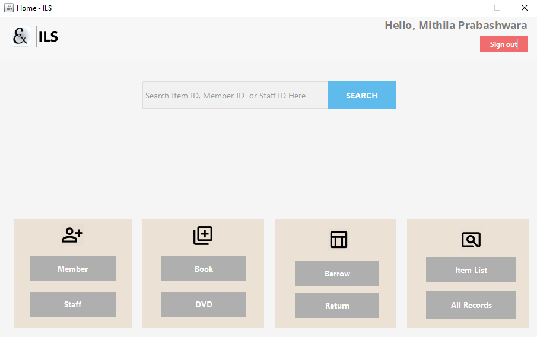
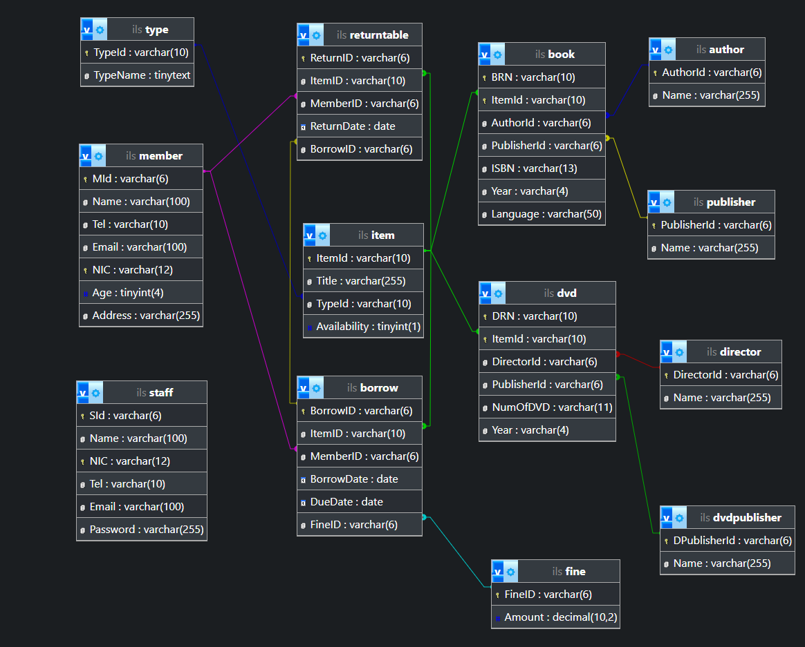
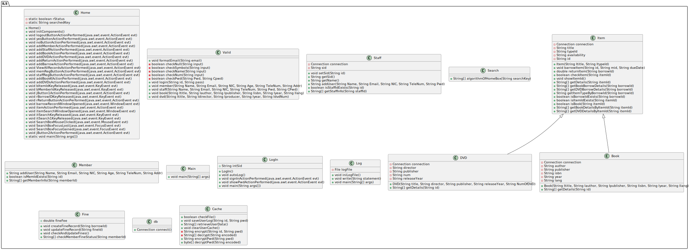
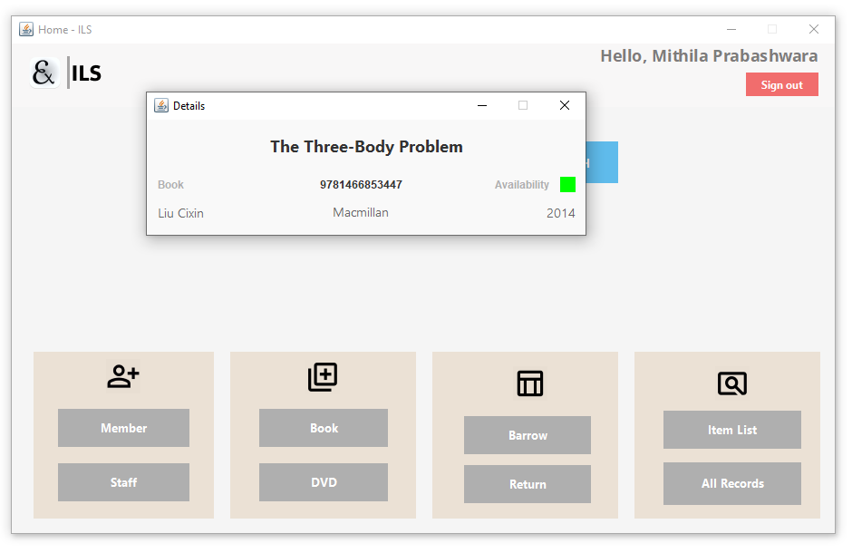
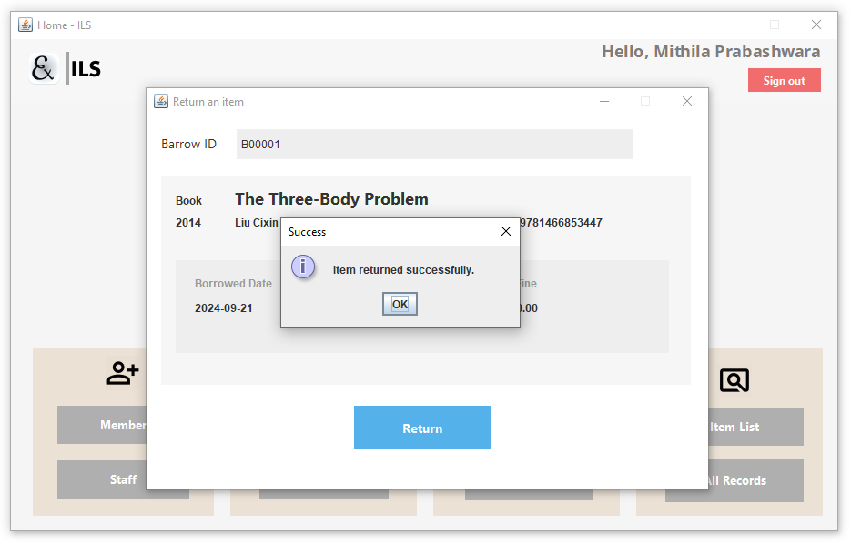
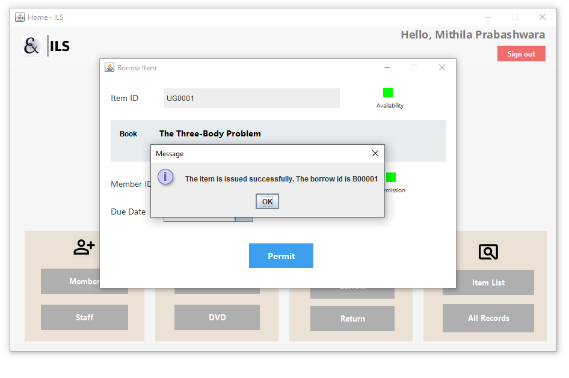
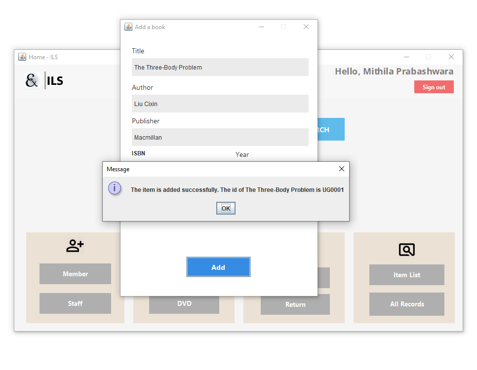

# ILS (Integrated Library System)


## Introduction
ILS is an Integrated Library System designed to manage library operations such as cataloging, member management, borrowing, and returning items. This system is built using Java and provides a graphical user interface for ease of use.

## Features
- **Member Management**: Add, update, and retrieve member information.
- **Staff Management**: Add, update, and retrieve staff information.
- **Item Management**: Add, update, and retrieve information about books and DVDs.
- **Borrowing and Returning**: Manage borrowing and returning of items.
- **Fine Management**: Calculate and manage fines for overdue items.
- **Logging**: Log system activities and errors.
- **Caching**: Cache user login information for auto-login.

## Structure

### Database


### Class Diagram


## Installation
1. **Clone the repository**:
    ```sh
    https://github.com/mthlpbs/Library-Management-System.git
    cd ILS
    ```

2. **Set up the database**:
    - Ensure you have MySQL installed.
    - Create a database named `ils`.
    - Import the database schema from `schema.sql` (if provided).

3. **Configure the database connection**:
    - Update the database connection details in `db.java` if necessary.

4. **Build the project**:
    - Open the project in your preferred IDE (e.g., IntelliJ IDEA, Eclipse, VS Code).
    - Build the project to resolve dependencies.

## Usage
1. **Run the application**:
    - Execute the `Main` class to start the application.
    - If a user cache file exists, the system will attempt auto-login. Otherwise, the login window will be displayed.

2. **Logging in**:
    - Enter staff ID as S00001 and password as 12345 to log in.

3. **Managing items**:
    - Use the provided GUI to add, update, and retrieve information about books and DVDs.

4. **Borrowing and returning items**:
    - Use the GUI to manage borrowing and returning of items.
    - The system will automatically calculate fines for overdue items.

## Screenshots








